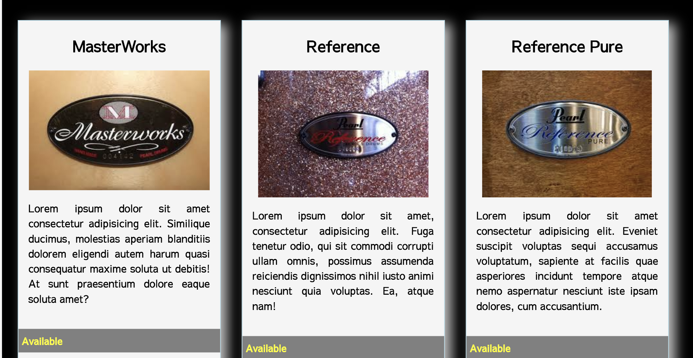

# Product Cards

# Technologies Used:

    1. HTML5 and CSS

# Description 

This project built a grid of cards for Pearl Corporation's different drumset series. We worked on our HTML and css skills by utilizing standard elements, FlexBox, media queries and Google Fonts. 

# Screenshots

# Instructions 

1. Go to: `https://www.npmjs.com/package/http-server` and install "http-server".  
2. Navigate to the project folder in command line interface and type: `http-server -p 8080`  
3. This will show at: `http://localhost:8080` in your internet browser.  

